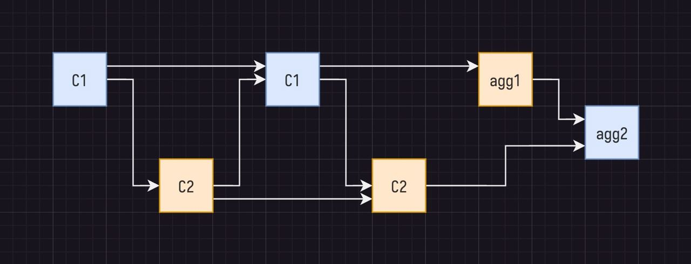

# Goal
We only need to write the final IVC verifier circuit which runs the nark verfier and the decider on the final IVC proof. [IVC](split_acc.png)

## Challenges 
1. Work over two cycles of curves so two aggregation circuits 
2. The protostar prover is using hyperplonk proving system, but we need to write a verifier for it using halo2 backend

### 1 Working with cycles
Do we use cycles of curves for snark verifier? 
Yi - yes the nark verifier circuit needs to work on the cycles of curve 

### 2 Hyperplonk backend

1. verify_hyrax_hyperplonk is using HyperPlonkVerifierParam imported from Hyperplonk backend. It also uses verify_sum_check_and_query which in turn imports uses point_offset from the Hyperplonk backend.

2. point_offset is used in verify_sum_check_and_query

3. Hyperplonk used in verify decider

### TODO
1. Convert strawman file to use modules from halo2-lib/ecc -- highly sure, recommended by Han from PSE who is working on Protostar implementation